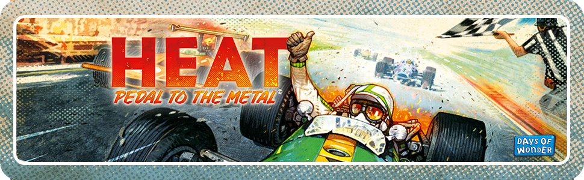

# HEAT Tournament Manager



[](https://www.gnu.org/licenses/gpl-3.0)
[](https://reactjs.org/)
[](https://www.typescriptlang.org/)
[](https://vitejs.dev/)

## 🏁 About

HEAT Tournament Manager is a web application designed to manage tournaments for the board game "HEAT: Pedal to the Metal." This app runs entirely client-side, requiring no server infrastructure, making it perfect for tournament organizers to use locally at gaming events.

## 🎮 Live Application

**Try it now**: [HEAT Tournament Manager](https://your-username.github.io/HEAT-Tournament-Manager/) *(URL to be inserted)*

## ✨ Features

- **Tournament Management**: Create, organize, and track live tournaments
- **Player Registration**: Register up to 12 players per tournament
- **Automated Scoring**: Manage scores based on finishing positions
- **Tournament Simulation**: Run tournament simulations with random results
- **History Tracking**: View complete tournament history with results
- **Offline Support**: Works entirely client-side with local storage

## 🏎️ Tournament Format

HEAT Tournament Manager supports the following tournament structure:
- 12 players divided into 2 tables
- 2 rounds of games
- Each player plays 2 games total
- Points awarded based on finishing position (9-6-4-3-2-1)
- Difficulty bonus based on opponent mastery scores
- Final ranking based on total points + difficulty bonuses

## 🛠️ Installation and Setup

1. Clone the repository
   ```bash
   git clone https://github.com/your-username/HEAT-Tournament-Manager.git
   cd HEAT-Tournament-Manager
   ```

2. Install dependencies
   ```bash
   npm install
   ```

3. Start the development server
   ```bash
   npm run dev
   ```

4. Build for production
   ```bash
   npm run build
   ```

## 🧰 Technologies Used

- React 18
- TypeScript
- Vite
- Bootstrap
- Local Storage for data persistence

## 📋 License

This project is licensed under the GPL-3.0 License - see the [LICENSE](LICENSE) file for details.


## 🙏 Acknowledgements

- [HEAT: Pedal to the Metal](https://boardgamegeek.com/boardgame/366013/heat-pedal-metal) - The awesome racing board game this app is built for
- [Days of Wonder](https://www.daysofwonder.com/) - The publisher of HEAT 